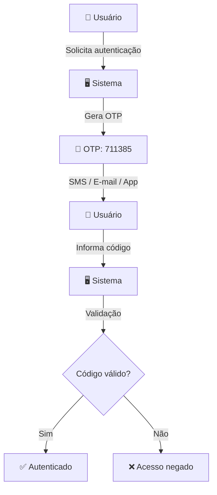

# One-Time Password (OTP)

Um **One-Time Password (OTP)** é uma senha ou código de autenticação que pode ser utilizado apenas uma vez, geralmente dentro de um período limitado de tempo.

OTPs são amplamente utilizados como uma camada adicional de segurança em processos de **autenticação**, **confirmação de identidade**, **recuperação de conta** e **validação de operações sensíveis**.

## 📌 Sumário

- [O que é OTP?](#o-que-é-otp)
- [Como funciona](#como-funciona)
- [Tipos de OTP](#tipos-de-otp)
- [Exemplo de fluxo](#exemplo-de-fluxo)
- [Segurança](#segurança)
- [Boas práticas](#boas-práticas)
- [Vantagens e limitações](#vantagens-e-limitações)
- [Exemplo de implementação](#exemplo-de-implementação)
- [Conclusão](#conclusão)

## O que é OTP?

**OTP** significa **One-Time Password**, ou **senha de uso único**.

Diferentemente de uma senha tradicional, que pode ser reutilizada várias vezes, um OTP normalmente possui:

- Uso único
- Tempo de expiração curto
- Quantidade limitada de tentativas
- Geração aleatória ou baseada em um algoritmo criptográfico

Um exemplo seria um código de seis dígitos:

```
711385
```

O usuário recebe esse código e precisa informá-lo durante o processo de autenticação antes que ele expire.

## Como funciona

Um fluxo simples de OTP pode ser representado da seguinte forma:



De maneira geral:

1. O usuário inicia uma operação que exige autenticação
2. O servidor gera ou calcula um OTP
3. O código é enviado ao usuário por um canal previamente configurado
4. O usuário informa o código
5. O servidor verifica o código
6. Se o código for válido e ainda estiver dentro do período de validade, a operação é autorizada
7. Depois de utilizado, o OTP é invalidado


## Tipos de OTP

### TOTP

**Time-based One-Time Password (TOTP)** gera códigos baseados no tempo.

O código muda periodicamente, normalmente a cada poucos segundos.

Exemplo:

```
12:00:00 → 381924
12:00:30 → 729105
12:01:00 → 514837
```

Aplicativos autenticadores são um exemplo comum de utilização desse modelo.

### HOTP

**HMAC-based One-Time Password (HOTP)** utiliza um contador para gerar os códigos.

Nesse modelo, o código muda conforme o contador é incrementado, em vez de depender diretamente do relógio.

De forma simplificada:

```
Counter 0 → 183729
Counter 1 → 492105
Counter 2 → 817364
```

### OTP por SMS

O servidor envia o código para o número de telefone cadastrado.

```
Seu código de verificação é: 583921
```

É simples de implementar, mas depende da segurança da rede móvel e do número de telefone do usuário.

### OTP por e-mail

O código é enviado para o endereço de e-mail associado à conta.

```
Código de verificação: 391827
```

É uma alternativa conveniente, especialmente para confirmação de cadastro e recuperação de acesso.

## Exemplo de fluxo

Imagine um usuário realizando login:

1. Usuário informa:
   ```
   email@example.com
   ********
   ```

2. Sistema valida as credenciais

3. Sistema solicita um segundo fator

4. OTP é gerado:
   ```
   739281
   ```

5. Código é enviado ao usuário

6. Usuário informa:
   ```
   739281
   ```

7. Sistema verifica:
   - ✓ Código correto
   - ✓ Código não expirado
   - ✓ Código ainda não utilizado
   - ✓ Limite de tentativas não excedido

8. Acesso concedido

## Segurança

Um OTP não deve ser tratado como uma senha comum.

O sistema deve considerar:

### Expiração

Defina um período curto de validade.

```
OTP criado: 14:30:00
Expiração:  14:32:00
```

Depois da expiração, o código deve ser rejeitado.

### Uso único

Depois de utilizado com sucesso, o OTP deve ser invalidado imediatamente.

```
OTP: 739281

Primeira tentativa → ✓ Válido
Segunda tentativa  → ✗ Inválido
```

### Limite de tentativas

Evite permitir tentativas ilimitadas.

Por exemplo:

```
Máximo de tentativas: 5
```

Depois disso, o processo pode ser bloqueado ou exigir a geração de um novo código.

### Rate limiting

Solicitações de novos códigos e tentativas de validação devem possuir mecanismos de rate limiting para dificultar ataques automatizados.

### Geração segura

Os códigos devem ser gerados utilizando uma fonte de aleatoriedade criptograficamente segura quando o protocolo utilizado exigir geração aleatória.

Evite abordagens previsíveis como:

- `Math.random()`
- Timestamp
- ID do usuário

### Não armazenar OTP em texto puro

Quando possível, o servidor deve evitar armazenar o OTP original diretamente.

Uma alternativa é armazenar um valor derivado, como um hash, e comparar o valor recebido durante a validação.

## Boas práticas

- Utilize códigos suficientemente difíceis de adivinhar
- Defina uma expiração curta
- Invalide o código após o primeiro uso
- Limite o número de tentativas
- Implemente rate limiting
- Não registre OTPs em logs
- Não inclua OTPs em mensagens de erro
- Proteja o canal utilizado para entrega
- Nunca solicite que usuários compartilhem OTPs com terceiros
- Para TOTP/HOTP, utilize bibliotecas e implementações de protocolos reconhecidos em vez de criar a criptografia manualmente
- Considere métodos de autenticação mais resistentes a phishing quando o nível de segurança exigido for alto
## Vantagens e limitações

| Característica | OTP |
|---|---|
| Uso único | ✅ |
| Expiração | ✅ |
| Fácil de implementar | ✅ |
| Pode funcionar como segundo fator | ✅ |
| Resistente à reutilização do código | ✅ |
| Totalmente resistente a phishing | ❌ |
| SMS depende da infraestrutura de telefonia | ⚠️ |
| Segurança depende da implementação | ⚠️ |

OTP melhora significativamente determinados fluxos de autenticação, mas não elimina todos os riscos de segurança.

Em particular, códigos OTP digitados pelo usuário podem ser capturados por ataques de phishing ou engenharia social.

## Exemplo de implementação

Um pseudocódigo simplificado poderia ser:

```pseudocode
function generateOTP():
    otp = secureRandomNumber(100000, 999999)

    store(
        hash(otp),
        expiresAt = now + 2 minutes,
        used = false
    )

    sendOTPToUser(otp)

function validateOTP(userOTP):
    record = findActiveOTP()

    if record does not exist:
        return INVALID

    if record.expiresAt < now:
        return EXPIRED

    if record.used:
        return INVALID

    if record.attempts >= 5:
        return BLOCKED

    if hash(userOTP) != record.hash:
        record.attempts += 1
        return INVALID

    record.used = true

    return VALID
```

> **Observação:** este código é apenas ilustrativo. Em produção, recomenda-se utilizar protocolos e bibliotecas de autenticação consolidados, além de controles adequados de armazenamento, concorrência, rate limiting e auditoria.

## Conclusão

One-Time Password (OTP) é um mecanismo de autenticação baseado em códigos de uso único e, frequentemente, com validade limitada.

Ele pode ser utilizado em diferentes cenários, como:

- Autenticação em duas etapas
- Confirmação de login
- Recuperação de conta
- Confirmação de operações
- Verificação de identidade
- Confirmação de cadastro

Uma implementação segura deve considerar não apenas a geração do código, mas também expiração, uso único, rate limiting, proteção contra tentativas de força bruta e segurança do canal de entrega.
